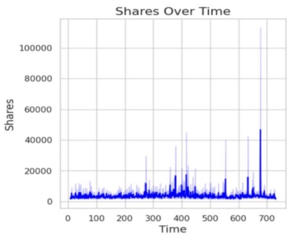

**MACHINE LEARNING REGRESSION SIGNATURE PROJECT** 

PREDICTIVE ANALYSIS OF NEWS ARTICLE USING 

MACHINE LEARNING REGRESSION 

BHAAVESH WAYKOLE SYMBIOSIS INSTITUTE OF TECHNOLOGY 

P.R.N: 21070122186  

**Table of Contents** 

[**ABSTRACT 	 2** ](#_page2_x69.00_y121.00)

[**INTRODUCTION 	 3** ](#_page3_x69.00_y401.00)

[**UNDERSTANDING THE DATASET: 	 4** ](#_page4_x69.00_y111.00)

1) [**Data Quality Assessment:	 4**](#_page4_x69.00_y244.00)
1) [**Summary Statistics: 	 4** ](#_page4_x69.00_y646.00)

[**EXPLORATORY DATA ANALYSIS: 	 5** ](#_page5_x69.00_y188.00)

[**Model Application, Data Splitting & Manipulation: 	 10** ](#_page10_x69.00_y420.00)

[**Feature Selection : 	 10** ](#_page10_x69.00_y558.00)

[**1)Using SKlearn library :	 10**](#_page10_x69.00_y613.00)

[**2)Using Annova Test:	 11** ](#_page11_x69.00_y111.00)

[**Model Analysis : 	 11** ](#_page11_x69.00_y403.00)

[**1)Linear Regression:	 11**](#_page11_x69.00_y458.00)

[**2)Decision Tree Regressor: 	 11**](#_page11_x69.00_y579.00)

[**3)Ridge and Lasso Regression: 	 12** ](#_page12_x69.00_y150.00)

[**Conclusion :	 14** ](#_page14_x69.00_y360.00)

[**References : 	 15** ](#_page15_x69.00_y401.00)

**ABSTRACT**: 

This report presents an in-depth Exploratory Data Analysis (EDA) for a machine learning regression project focused on predicting the popularity and shares of online news articles. The dataset, sourced from UC Irvine, is noteworthy for its completeness, as it contains no null values. The initial phase of the EDA highlights the correlation matrix, where we find that variables correlate perfectly  with  themselves  (diagonal  values  of  1).  However, outside the diagonal, deviations from 1 signal potential data problems  or  excessive  redundancy.  A  striking  finding  is  the perfect  linear  relationship  between  'n\_non\_stop\_words'  and 'n\_unique\_tokens,'  indicating  multicollinearity  that  can complicate regression analysis. 

Continuing  the  exploration,  the  report  emphasizes  the significance of the correlation matrix heatmap. It notes that when three variables – 'n\_unique\_tokens,' 'n\_non\_stop\_words,' and 'n\_non\_stop\_unique\_tokens' – display a perfect correlation of 1, it suggests a strong linear association, posing challenges for regression modeling. The report underscores the importance of investigating the reasons behind such high correlation, which could  result  from  data  anomalies  or  excessive  redundancy. Potential future steps, such as applying Principal Component Analysis (PCA), are suggested to address this issue. 

The EDA extends to reveal temporal trends in article shares through a time series plot. Notably, share counts exhibit sharp spikes at specific points, potentially reflecting significant events or  trends  influencing  sharing  behavior.  The  analysis  also uncovers variations in shares across different article categories, with "tech" articles garnering the highest shares and "lifestyle" articles receiving the lowest. The dominance of "world" articles, followed by "tech" and "entertainment," informs content strategy and  audience  engagement.  Lastly,  sentiment  analysis demonstrates that articles with neutral to positive sentiments are more likely to be shared, emphasizing the importance of content sentiment  in  predicting  article  shares.  This  EDA  provides  a foundational  understanding  for  the  subsequent  regression modeling  phase,  offering  insights  into  the  dataset's characteristics and potential challenges. 

In  addition  to  using  linear  regression  to  evaluate  model performance,  we  also  used  ridge,  lasso,  and  decision  tree regressions. Results of the model were significantly influenced by  the  feature  selection  techniques  chosen.  Given  the importance of addressing strong variable correlations that affect regression results, this EDA serves as a valuable foundation for subsequent regression modelling. 

**INTRODUCTION**: 

The popularity of news items is crucial in a time when the internet  has  replaced  print  media  as  the  main  source  of information.  Understanding  the  factors  that  influence  article popularity  can  have  a  big  impact  on  the  production  and distribution of information. This study intends to explore the complex relationship between article features and readership engagement  by  utilizing  the  ability  of  machine  learning regression to predict news article popularity based on a rich dataset. In this analysis, we explore the data, assess its quality, create  predictive  models,  and  offer  insights  that  may  help publishers and news organizations plan their content initiatives. 

In this analysis, we explore the data, assess its quality, create predictive models, and offer insights that may help publishers and news organizations plan their content initiatives . 

**UNDERSTANDING THE DATASET:** 

The project starts with acquiring the dataset, which has 39,644 rows and 61 columns. 'Shares' is the target variable. 

1) **Data Quality Assessment:** 

The evaluation of data quality is a crucial phase in every data analysis process. No null values were discovered in this dataset, making all 39,644 items complete and available for analysis. This was shown using a heatmap, which demonstrated that no data was missing. 

Figure 1.  

2) **Summary Statistics:** 

Summary statistics were created to help understand the dataset. The summary statistics provide information about the major trends, minor variances, and potential outliers in the dataset. As an illustration, the average number of shares is roughly 3,395 with a wide range of values between 1 and 843,300.  

We move on to the following phases of the project, which involve Exploratory data analysis and model creation, with a clear and complete dataset. 

**EXPLORATORY DATA ANALYSIS:** 

We performed exploratory data analysis to better understand the dataset and its features. The following is a summary of the visualizations and analysis  

performed during this  

phase:  

Because a variable is fully  

associated  

with itself (the correlation  

between a  

variable and itself is always  

` `1), the diagonal of a  

correlation matrix  

always has the value 1.  

In contrast, it's unusual to  

find values outside of the  

diagonal of a correlation  

matrix other than 1, as  

variables shouldn't be  

perfectly correlated unless  Figure 2. 

there is a problem with the data.  

The presence of values other than 1 outside the diagonal may indicate a problem with the data or 

the existence of extremely 

redundant. 

A perfect linear relationship exists between these two variables, as shown by the scatter plot of 'n\_non\_stop\_words' versus 'n\_unique\_tokens'. This suggests multicollinearity at a high level, which might be troublesome for regression analysis. To overcome this issue, think about conducting additional research and possibly eliminating one of the factors. 



Figure 3. 

If the correlation matrix heatmap shows a perfect correlation of 1, it signifies that all three of the variables "n\_unique\_tokens,","n\_non\_stop\_words," and "n\_non\_stop\_unique\_tokens" — are incredibly well associated with one another. This suggests a strong linear relationship between them, which can make regression analysis challenging. 

Investigating the data and figuring out why these variables 

are completely connected in this situation is crucial. It can be the result of a data problem, like duplicated or extremely redundant columns. Hence we will perform PCA on these later if needed. 

The time series plot  demonstrates  changes in the share  count over  

time. Notably, shares  tend to rise  

sharply around 550  and between  

600 and 700, with  some values  exceeding 4000. For  the purpose of  generating content  and developing  marketing strategies, these periods  Figure 4. may point to particular occurrences 

or trends that have an impact on the 

number of shares. 

Highest share is observed for tech and lowest share is observed for lifestyle. 



Figure 5. 

This shows that articles  related to world are the  maximum as compared  to  

tech and entertainment.  

Still, tech holds the  highest shares followed  by  

entertainment than  world.  Figure 6. 

This plot shows that Maximum  shares were done on  Wednesday and the least on  weekends.  

Figure 7. 

The Plot tells us that articles containing  positive words are shared the most as  compared to the articles with negative  words.  

We can also say that from above  analysis that from figure 5, we see that  tech, entertainment and world has more  shares than others, where in tech has  the most shares by others hence can say  that people share articles with the above  interest which contains positive words  

Figure 8. 

The figure beside shows that the  article is shared based on the good  sentiment, the positive sentiment  rather than the just reading the  title. Hence, we can say that  content of the article has more of  attraction than the title.  

The plot beside shows that there  are four data channels number of  links ,number of links by Mashable  number of images and number of  videos. We are clearly can see that  number articles with a greater  number of links and shared more  than number of images and  number of videos.  

Hence, we can say that article  articles which has more shares  such as tech world and  entertainment etc. are shared  which has more links than any other images and videos. 

This shows that texts having  neutral to positive sentiments  are shared more as compared  to negative sentiments and  most positive texts sentiments.  

**Model Application, Data Splitting & Manipulation:** 

For the model testing we used the whole data and by using two methods of feature selection. 

**Feature Selection :** 

1) **Using SKlearn library :** 

At start firstly feature selection was performed using SKlearn library and selected approximately k = 5 features and got features to 

select namely: 

- timedelta', ' kw\_max\_avg', ' self\_reference\_min\_shares', 
- self\_reference\_max\_shares', ' self\_reference\_avg\_sharess'. 
2) **Using Annova Test:** 

Annova test was used on the whole data set to get all the features who gives “pvalue” above 0.5 and resulting 8 features were selected namely: ‘ n\_tokens\_title', ' num\_self\_hrefs', ' kw\_min\_min', ' kw\_min\_max', ' title\_subjectivity', ' title\_sentiment\_polarity', ' abs\_title\_subjectivity', ' abs\_title\_sentiment\_polarity' 

**Model Analysis :** 

1) **Linear Regression:** 

a. Using Linear Tree regression and it’s observed that there is none overfitting but the model has performed too poorly and we might have to consider another models to apply. 

2) **Decision Tree Regressor:** 
1. Decision Tree Regression gave more declining results as compared to linear regression and ridge lasso regression. 
1. Decision tree regression gives results with a lot of over fitting and with a very unexpected results with negative test accuracy. 
1. Upon little research it might be due to data leak or model complexity done or performed. 
4. To avoid this PCA can be used later the data frame to overcome this issue . 
3) **Ridge and Lasso Regression:** 

a. With Ridge and Lasso we too get somewhat similar results like linear regression and without overfitting. Using the two Feature Selection method on the three models used we nearly get similar results . The results are not differing much. Later there might have need of using PCA for later use. 

**Results and Observations :** 

After Applying Feature Selection from SKlearn and Annova Test we see that models perform differently in both of the Feature selection techniques . 

Sklearn Library :-  

\1) Keeping k = 5 which select 5 features from the data frame: 

Selected features are  ' timedelta', ' kw\_max\_avg', ' self\_reference\_min\_shares', ' self\_reference\_max\_shares', 

- LDA\_02' 

Model Performances: 

Linear Regression :  

Mean squared error: 0.8743081737024112 R-squared score: 0.020556623027627285 

Train:  0.015274765978087745 

Test:  0.020556623027627285 

Decision Tree Regressor: 

Mean Squared Error (MSE): 1.2625192709818902 R-squared (R2) Score: 0.009209570853510596 

Train:  0.02562420203716076 

Test:  0.009209570853510596 

Ridge Regression :  

Mean Squared Error (MSE): 0.8743084226578501 R-squared (R2) Score: 0.020556344135397753 Train: 0.015274765794159317 

Test: 0.020556344135397753 

Lasso Regression :  

Mean Squared Error: 0.8744112415331842 R-squared (R^2): 0.020441161332008018 

Train:  0.01526093787275562 

Test:  0.020441161332008018 

Annova Test : 

Selected features ' n\_tokens\_title', ' n\_unique\_tokens', ' n\_non\_stop\_unique\_tokens', ' num\_self\_hrefs', ' kw\_min\_min', 

- kw\_min\_max', ' title\_subjectivity', ' title\_sentiment\_polarity', ' abs\_title\_subjectivity', ' abs\_title\_sentiment\_polarity' 

From where in features ' n\_tokens\_title', ' n\_unique\_tokens', ' n\_non\_stop\_unique\_tokens' are ignored as they cause multi-collinearity. 

Linear Regression :  

Mean squared error: 1.273090264880288 R-squared score: 0.0009137453387420003 Train:  0.000975080738928491 

Test:  0.0009137453387420003 

Decision Tree Regressor: 

Mean Squared Error (MSE): 1.273497473704422 R-squared (R2) Score: 0.0005941790438829253 Train:  0.000975080738928491 

Test:  0.0009137453387420003 

Ridge Regression :  

Mean Squared Error (MSE): 0.8919735070972031 R-squared (R2) Score: 0.0007670404571377132 Train:  0.0009782174246707465 

Test:  0.0008285512264926131 

Lasso Regression :  

Mean Squared Error: 0.8919791954003646 R-squared (R2): 0.0007606681378281577  

Train:  0.0010498098804510025 

Test:  0.0007606681378281577 

In above Tests we see that models have not performed as well  as  they  have  performed  on  features  selected  by SKlearn library. 

**Conclusion :**  

In conclusion, the thorough Exploratory Data Analysis (EDA) of the dataset, acquired from UC Irvine, for predicting online news article  popularity  and  shares  has  unveiled  several  pivotal insights.  The  absence  of  null  values  ensures  data  integrity, providing a robust foundation for the regression project. Key observations  include  the  identification  of  potential multicollinearity, highlighting the need for further investigation and  potential  data  preprocessing measures.  The  time series analysis  exposed  temporal  trends  in  share  counts,  while category-specific share patterns emphasized the significance of "tech" articles and the lowest shares among "lifestyle" articles. Sentiment analysis reinforced the influence of content sentiment on shares. The report also hints at future considerations like Principal  Component  Analysis  (PCA)  to  address  data complexities,  thereby  equipping  us  with  a  comprehensive understanding  and  actionable  insights  for  building  robust regression  models  to  predict  online  news  article  shares accurately. 

The importance of content sentiment in predicting article shares was also highlighted by sentiment analysis, which showed that articles with neutral to positive sentiments are more likely to be shared. 

We used ridge and lasso regression, decision tree regression, and linear regression for the model analysis. Following feature selection, these models were assessed using the SKlearn library and the Annova test. Notably, the model performances varied depending on the feature selection methods used. 

Overall, the EDA offers insightful information about the features of the dataset and potential difficulties, laying the groundwork for  additional  regression  modelling  and  the  application  of suitable feature selection techniques for increased predictive accuracy. It is advised to conduct more research to comprehend and address the strong correlations between some variables, which have a significant impact on regression results. 

**References :** 

1. **OpenAI. (2023). ChatGPT: A Language Model for Text Generation. URL: [Insert the URL where ChatGPT can be accessed]** 

**Dataset :**  

2. **Fernandes,Kelwin, Vinagre,Pedro, Cortez,Paulo, and Sernadela,Pedro. (2015). Online News Popularity. UCI Machine Learning Repository. [https://doi.org/10.24432/C5NS3V.](https://doi.org/10.24432/C5NS3V)** 

**NOTE:-**  

**Link to Colab Notebook :** 

**https://colab.research.google.com/drive/1\_NGrD74zPRpoYmAHGsxHejO aWORsqwwJ?usp=sharing** 
